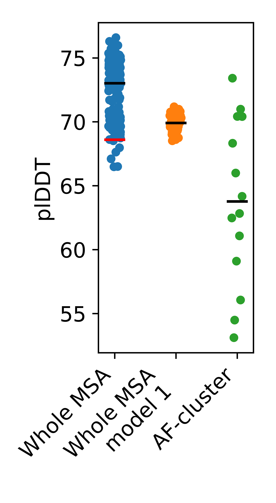

![header]
#AF-cluster controls.

Update: Figure S1a was run with the monomer setting.  We learned that we should have used the monomer_ptm preset instead of monomer.  

Model presets make no difference: random sequence sampling still outperforms AF-cluster. 

We also show the distribution of points for model 1 only, since Wayment-Steele et al. used only model 1 (for reasons we don't understand).  Random sequence sampling still outperforms.

